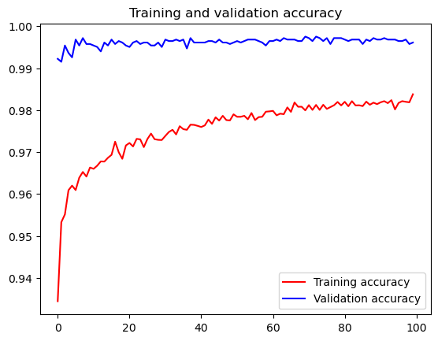
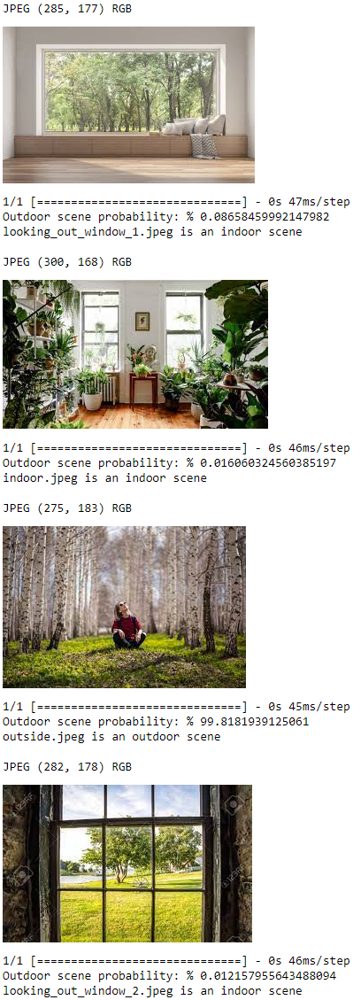

# Indoor vs. Outdoor Photo Classifier using Transfer Learning with Inception V3

<p align="center">
    
</p>

This repository contains a machine learning project that aims to classify indoor and outdoor photos using transfer learning with the Inception V3 model. The Inception V3 model is a deep convolutional neural network (CNN) that has been pre-trained on a large dataset, making it a powerful feature extractor for image classification tasks.

## Table of Contents

- [Introduction](#introduction)
- [Dataset](#dataset)
- [Usage](#usage)
- [Results](#results)
- [Contributing](#contributing)
- [Acknowledgments](#acknowledgments)

## Introduction

Classifying locations in photos is a common task in computer vision applications. By leveraging the pre-trained Inception V3 model and applying transfer learning, this project aims to achieve accurate and efficient classification results with minimal training effort.

Transfer learning involves taking a pre-trained model (Inception V3 in this case) and retraining the final layers of the model on a specific dataset. This approach allows us to leverage the learned features from the original dataset while fine-tuning the model to adapt to the indoor vs. outdoor classification problem.

## Dataset

The dataset used in this project contains a labeled collection of indoor and outdoor photos. It is crucial to ensure that the dataset is properly balanced and well-annotated to achieve reliable classification results.

The dataset can be structured as follows:
```
dataset/ 
    ├── training/ 
    │       ├── indoor/ 
    │       └── outdoor/ 
    └── validation/ 
            ├── indoor/ 
            └──outdoor/
```

 You can either use your own dataset or explore publicly available datasets like ImageNet, CIFAR-10, or other image repositories. I used the [MIT Indoor Scenes Dataset](https://www.kaggle.com/datasets/itsahmad/indoor-scenes-cvpr-2019?resource=download), the [Landscape Pictures Dataset](https://www.kaggle.com/datasets/itsahmad/indoor-scenes-cvpr-2019?resource=download), and the [Raw Image Dataset](http://loki.disi.unitn.it/RAISE/index.php) for this project.

## Usage

To get started with the project, follow these installation steps:

1. Clone the repository to your local machine.

2.  Open the Jupyter Notebook:
```
indoor-v-outdoor.ipynb
```

3.  Install the required dependencies, if needed:

```bash
pip install -r requirements.txt
```

4.  Ensure your dataset is prepared and follows the structure mentioned in the [Dataset](#dataset) section.
    
5.  Run all cells in the jupyter notebook to perform transfer learning and train the model.
  
6.  Once the training is complete, the notebook will display the classification accuracy during training and validation.

7.  You can test the model on your own photos using the test jupyter notebook. 
```
indoor-v-outdoor-test.ipynb
```
8. To test my trained model, download the [indoor-v-outdoor.h5](https://drive.google.com/file/d/1nOdrHWWltnMcrCWPueJ9kEtnUr6-KOaQ/view?usp=drive_link) model file.

Feel free to experiment with hyperparameters, different optimizers, and learning rates to optimize the model's performance further.

## Results

My model achieved a 98.20% training accuracy and an even better 99 .61% validation accuracy:

<p align="center">
    
</p>

Here are some sample predictions I made using the model:

<p align="center">
    
</p>

## Contributing

Contributions to this project are welcome! If you have any suggestions, bug fixes, or improvements, please create an issue or submit a pull request.

## Acknowledgments

I would like to acknowledge the inspiration for this project, which stems from a challenging experience during a Machine Learning (ML) interview. I had been asked how I would develop an ML model to classify images as indoor or outdoor. Since my approach was met with disagreement from the interviewer, this motivated me to pursue this project to show my understanding of image classification techniques. Also proving my method was, indeed, effective.
